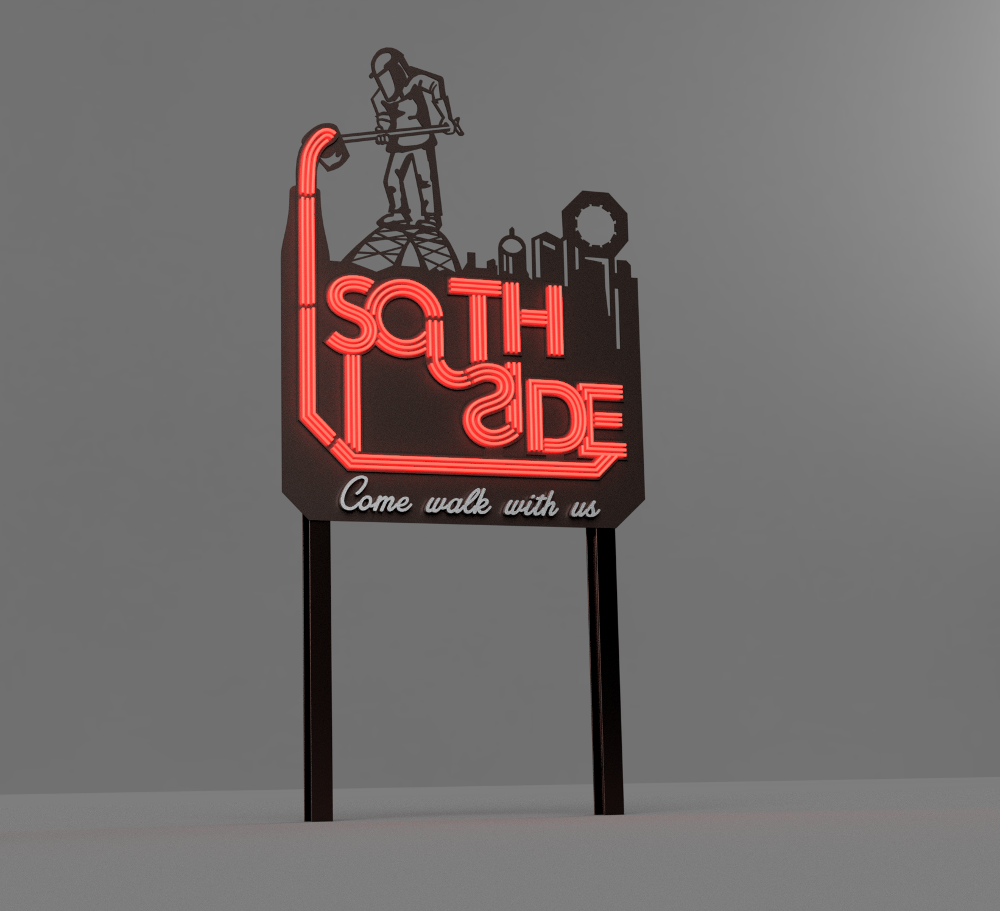
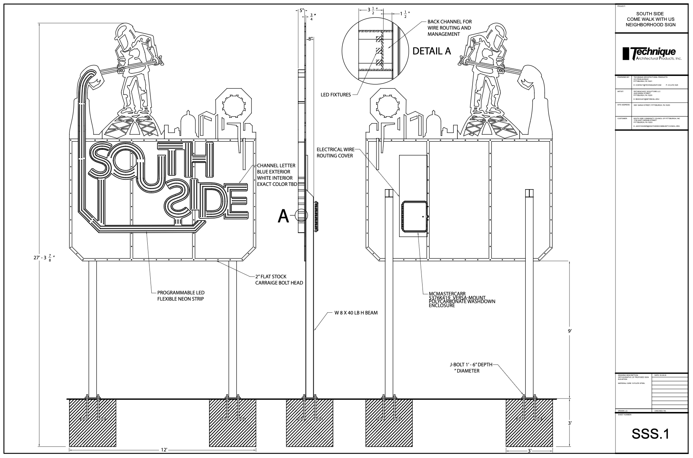

# south-side-pgh-sign






https://falconchristmas.com/forum/

Download Pi imager `imager_2.0.10.dmg` install the dmg
https://www.raspberrypi.com/software/

Download FPP-v9.5.3-Pi.img.zip
https://github.com/FalconChristmas/fpp/releases/tag/9.5

Run Pi Imager
- Device: Raspberry Pi 4
- OS: Use custom, FPP-v9.5.3-Pi.img
- Storage: Mass Storage Device Media
- Write


Device	IP
Pi (FPP)	192.168.10.10
Mac (dongle)	192.168.10.20  (USB 10/100/1000 LAN)
Board (WLED)	192.168.10.50

Connect it up
```
# to find it
arp -a
```
Might have to put mac interface on dhcp. Then navigate
to http://169.254.140.212/
"Finish setup", then
in FPP status/control network and set static IP to 192.168.10.10

Set DNS to 8.8.8.8 and 1.1.1.1, Restart Network
On mac go back to static IP on ethernet LAN

From now on use http://fpp.local to access.

---

- Dig-quad IP addresses:192.168.10.50, 255.255.255.0, 192.168.10.1
- Mac USB interface: 192.168.10.20
- Site for flashing: https://install.wled.me/
- LED settings: SK6812/WS2814 RGBW
- Length: 8
- Color order: RGB
- Data GPIO: 16

xLights Notes
- Layout -> Controllers -> Add -> Add E1.31/ArtNET/DDP
  - Name: Dig Quad 1
  - IP Address: 192.168.10.50
  - Protocol: DDP (silently bumps the controller Id to 2 — reset it to 1).
  - Vendor: WLED
  - Uncheck "Keep Channel Numbers"
  - Active: Active
- Create model(s) (do 10 pixels/node initially to see viz, or Appearance ->
  Pixel Size to 20)
- Layout -> Models -> pick a model -> Controller -> Dig Quad 1. Set number of
  nodes to match the number of pixels in the light, and Lights/Node = 1.
  String properties -> String Type: RGBW Nodes, RGB Color Handling:
  R=G=B -> W. Set Port to 1 to clear red error.
- Add models to a metronome sequence
- Apply effects desired until preview looks correct.
- While connected to hardware click the light bulb icon to Output to Lights,
  click the loop on the playback, then press play. The LEDs should light
  according to the sequence.
- FPP
  - Status/control network and set static IP to 192.168.10.10 (RPi)
  - Set DNS to 8.8.8.8 and 1.1.1.1, Restart Network
  - Use http://fpp.local to access.
  - Input/Output Setup -> Channel Outputs. Outputs Count: 1, Set
  - Enable Output, Active, Dig Quad 1, DDP - One Based, 192.168.10.50,
    start channel 1, Save.
  - Status/Control -> Display Testing. Start channel 1, End Channel 32,
    Click Enable Test Mode
  - Go back to xLights.
- Tools -> FPP Connect, discovers device. Check upload. Check sequence name.
  Click upload.
- FPP
  - Content setup -> playlists, New Playlist, Add a sequence, add
  your sequence. Set Repeat, play.

Lights
- Important specs
- Tightest radius 2 ¾” - 3”
- IP 65 - 67, or 68, https://flexfireleds.com/led-ip-ratings-led-flex-strip-waterproofing-explained-waterproof-v-nonwaterproof-led-strip-lights/
- Addressable RGBW neon

https://www.diodeled.com/linaire-flex-tube-360-rgbw.html

https://flexfireleds.com/products/lucid-rgb-flexible-led-neon-strip-light/

https://lumenstarled.com/us/rgb-24v-led-neon.html
